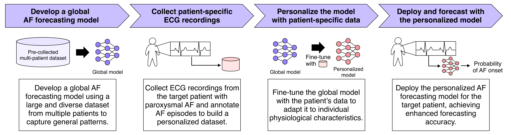
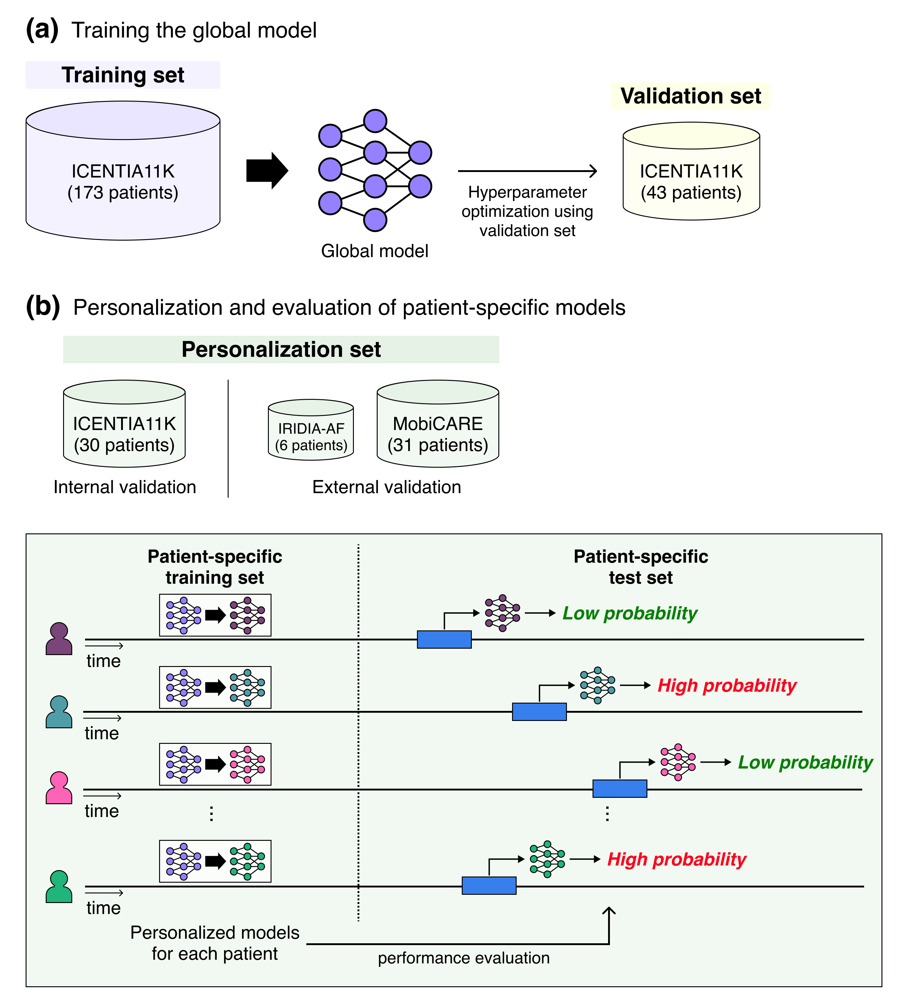

# Personalized deep learning for short-term forecasting of impending atrial fibrillation from continuous wearable ECG signals

This repository contains the code for the experiments conducted in our research paper titled [_Personalized deep learning for short-term forecasting of impending atrial fibrillation from continuous wearable ECG signals_ (Scientific Reports, 2026)](https://www.nature.com/articles/s41598-026-71571-6).

It provides the full pipeline for personalized paroxysmal AF (PAF) forecasting: building pre-AF/non-AF datasets from long-term single-lead ECG recordings, training a *global* forecasting model on ICENTIA11K, fine-tuning that model on each individual patient's own ECG to obtain *personalized* models, evaluating both on held-out patient data, and visualizing feature attributions on the personalized models.

<p align="center">
    
</p>

## Abstract
Continuous wearable electrocardiogram (ECG) monitoring is increasingly used for ambulatory arrhythmia surveillance, yet forecasting impending atrial fibrillation (AF) remains challenging because of inter-patient ECG variability. We investigated whether personalizing a global model by fine-tuning it on an individual’s ECG improves short-term AF forecasting. A global model trained on ICENTIA11K was compared with personalized models fine-tuned across three cohorts (ICENTIA11K, IRIDIA-AF, and MobiCARE), using 60-second ECG segments and a five-minute forecast horizon. We assessed how the amount of adaptation data affected performance and analyzed ECG features such as heart rate and RMSSD. Personalized models significantly outperformed the global model, with AUROCs of 0.711 vs. 0.614 (ICENTIA11K) and 0.686 vs. 0.585 (MobiCARE), and the benefits grew with more patient-specific fine-tuning data. While the global model’s accuracy rose as AF onset approached, personalized models in the two external cohorts showed distinct temporal dynamics, suggesting that they captured patient-specific cues less dependent on onset proximity. Pre-AF episodes showed elevated heart rate and RMSSD, and feature attributions highlighted clinically relevant precursors, including frequent premature atrial complexes (PACs) and short supraventricular tachycardias (SVTs). Adapting deep learning models with patient-specific wearable ECG data significantly enhances short-term AF forecasting, supporting timely preventive intervention and improved AF management in ambulatory monitoring.

## Citation
If you find our research or repository useful, please consider citing our work:
```
@article{suh2026personalized,
  title={Personalized deep learning for short-term forecasting of impending atrial fibrillation from continuous wearable ECG signals},
  author={Suh, Jangwon and Kwon, Soonil and Ko, Jungmin and Kim, Yun Kwan and Song, Hee Seok and Choi, Eue-Keun and Rhee, Wonjong},
  journal={Scientific Reports},
  year={2026},
  publisher={Nature Publishing Group UK London}
}
```

## Requirements
This experiment was tested using the following environments:
- Python 3.10
- PyTorch 1.12.1
- Please refer to `requirements.txt` for other libraries.

```bash
pip install -r requirements.txt
```

## Getting Started
### Overview of the experimental design
<p align="center">
    
</p>


### 1. Building Datasets
Please refer to the [Dataset README](dataset/README.md) for detailed instructions on how to build and preprocess the ICENTIA11K and IRIDIA-AF datasets.

The dataset building process will generate the following files:
- **ICENTIA11K**: `training.pickle`, `validation.pickle`, `test_p_tr.pickle`, `test_p_te.pickle`
- **IRIDIA-AF**: `test_p_tr.pickle`, `test_p_te.pickle`

### 2. Running Experiments

Our experiments follow a four-stage pipeline:

#### Stage 1: Train a Global Model
Train a global AF forecasting model using the ICENTIA11K training and validation sets.

```bash
bash scripts/train_global_icentia11k.sh
```

---

#### Stage 2: Evaluate Global Model on Personalization Sets
Evaluate the pre-trained global model on patient-specific test sets from both ICENTIA11K and IRIDIA-AF datasets (without personalization).

**For ICENTIA11K:**
```bash
bash scripts/eval_global_icentia11k.sh
```

**For IRIDIA-AF (External Validation):**
```bash
bash scripts/eval_global_iridia-af.sh
```

---

#### Stage 3: Personalize the Global Model
Fine-tune the global model using patient-specific training sets to create personalized models for each patient.

**For ICENTIA11K:**
```bash
bash scripts/train_personalized_icentia11k.sh
```

**For IRIDIA-AF:**
```bash
bash scripts/train_personalized_iridia-af.sh
```

---

#### Stage 4: Visualize Feature Attribution
Analyze which ECG features are most important for AF forecasting using attribution methods on the personalized models.

```bash
bash scripts/run_attribution_icentia11k.sh
```

## Notes

- All scripts run experiments with 5 different random seeds (0-4) to ensure reproducibility and statistical robustness
- Modify the `GPU_NUM` variable in each script to specify which GPU to use
- Modify data paths in the scripts if your datasets are stored in different locations
- The IRIDIA-AF dataset is used for external validation to test generalizability